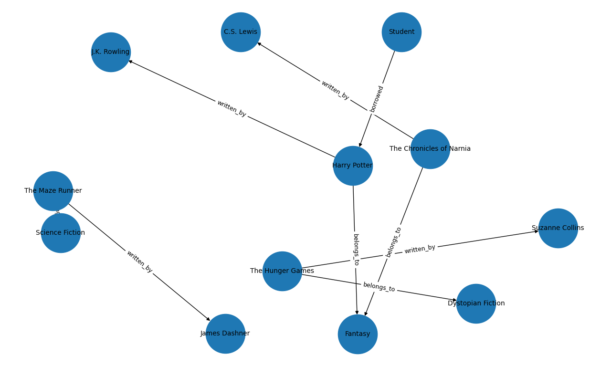

# AI Assignment 5

**Name:** Adarsh Singh  
**Roll No:** SE24UCSE120

---

## Overview

This repository contains implementations for four AI topics: game-tree search algorithms, an AI-based travel planner, a knowledge graph exploration, and Bayesian network inference.

---

## Assignment 1: Search Algorithms

All four algorithms are implemented in the `search_algorithms/` folder and tested on a Tic-Tac-Toe game engine.

### `tic_tac_toe.py`
The shared game engine used by all search algorithms. Provides a `TicTacToe` class with methods for making moves, undoing moves, checking for a winner, and listing available moves.

### `minimax.py`
Implements the **Minimax** algorithm. It exhaustively explores the full game tree, assigning +1 for an X win, -1 for an O win, and 0 for a draw. The maximizing player (X) picks the move with the highest score; the minimizing player (O) picks the lowest.

### `alphabeta.py`
Implements **Alpha-Beta Pruning** on top of Minimax. Maintains alpha (best score for maximizer) and beta (best score for minimizer) bounds to prune branches that cannot influence the final decision, significantly reducing the number of nodes evaluated.

### `heuristic_alphabeta.py`
Implements **Heuristic Alpha-Beta Search** with a configurable depth limit. Instead of always searching to the terminal state, it cuts off at a given depth and evaluates the board using a heuristic function that scores lines with two-in-a-row or one-in-a-row patterns for both players.

### `mcts.py`
Implements **Monte-Carlo Tree Search (MCTS)**. Builds a search tree through repeated iterations of four phases — Selection (UCB1), Expansion, Simulation (random playout), and Backpropagation. Returns the move with the highest visit count after a configurable number of iterations.

### `tests.py`
Runs three test cases against all four algorithms:
- **Test 1 – Winning Move:** X has two in a row; expected move completes the win.
- **Test 2 – Blocking Move:** O has two in a row; X must block.
- **Test 3 – Empty Board:** Optimal first move is the center (index 4).

Each test prints the board state, chosen move, outcome, and PASS/FAIL status.

#### Sample Output
```
TEST CASE 1: Winning Move
Expected Move: 2

Minimax        → Move: 2  | PASS
Alpha-Beta     → Move: 2  | PASS
Heuristic AB   → Move: 2  | PASS
MCTS           → Move: 2  | PASS
```

---

## Assignment 2: AI Travel Planner

**File:** `travel_planner.py`

A rule-based AI travel planner that recommends Indian destinations based on user preferences. It scores each destination using three criteria:

| Criterion | Points |
|---|---|
| Budget match | +3 |
| Travel type match | +2 |
| Each matching interest | +1 |

The top recommendation generates a full personalised travel plan including duration, estimated cost, day-wise activities, and local foods to try.

**Destinations covered:** Goa, Manali, Jaipur, Rishikesh

#### Sample Interaction
```
Enter Budget (low / medium / high): medium
Enter Travel Type: beach
Your Interests: beach, nightlife

→ Top Pick: Goa (Score: 7)
   Duration: 3 Days | Cost: ₹8,000
   Day 1: Relax at Baga Beach
   Day 2: Enjoy Water Sports
   ...
```

---

## Assignment 3: Knowledge Graphs

**File:** `knowledgebase.py`

Builds and visualises a **Library Knowledge Graph** using NetworkX. The graph models relationships between students, books, authors, and genres.

**Entities:**
- Student, Books (Harry Potter, The Hunger Games, The Maze Runner, The Chronicles of Narnia)
- Authors (J.K. Rowling, Suzanne Collins, James Dashner, C.S. Lewis)
- Genres (Fantasy, Dystopian Fiction, Science Fiction)

**Relationships:** `written_by`, `belongs_to`, `borrowed`

The script also answers three queries directly from the graph:
- Books borrowed by the student
- Books written by C.S. Lewis
- All books in the Fantasy genre

**Knowledge Graph Visualisation:**



---

## Assignment 4: Bayesian Networks

**File:** `bayesian_networks.py`

Implements a **Bayesian Network** using `pgmpy` to model weather-related probabilistic dependencies.

**Network Structure:**
```
Rain ──→ WetGrass ←── Sprinkler
Rain ──→ Traffic
```

**Conditional Probability Tables:**
- `Rain`: P(Rain) = 0.3
- `Sprinkler`: P(Sprinkler=On) = 0.4
- `WetGrass`: depends on Rain and Sprinkler
- `Traffic`: depends on Rain

**Inference queries answered using Variable Elimination:**
1. Marginal probability of Wet Grass
2. Probability of Rain given Wet Grass is observed
3. Probability of Heavy Traffic given it is Raining

#### Sample Output
```
Network Valid: True

P(WetGrass)                     → Wet: 0.4026
P(Rain | WetGrass=Wet)          → Rain: 0.6584
P(Traffic=Heavy | Rain=True)    → Heavy: 0.75
```

---

## Dependencies

```bash
pip install pgmpy networkx matplotlib
```

---

## Running the Code

```bash
# Search Algorithms
cd search_algorithms
python tests.py

# Travel Planner
python travel_planner.py

# Knowledge Graph
python knowledgebase.py

# Bayesian Network
python bayesian_networks.py
```
